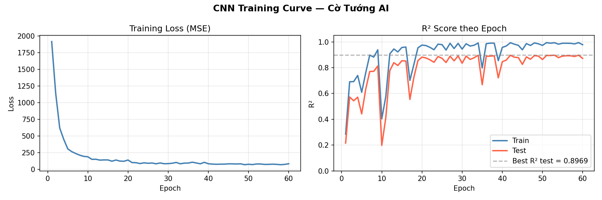

# Cờ Tướng AI

Game Cờ Tướng (Chinese Chess) viết bằng Python + Pygame, tích hợp AI sử dụng **CNN (Convolutional Neural Network)** kết hợp **Minimax + Alpha-Beta Pruning**.

---

## Kiến trúc AI

```
Input: (14, 10, 9)
  14 kênh nhị phân — mỗi kênh là binary map của 1 loại quân
  Bàn cờ 10 hàng × 9 cột

  ↓ Conv2d(14→32, 3×3) + BatchNorm + ReLU
  ↓ Conv2d(32→64, 3×3) + BatchNorm + ReLU
  ↓ Conv2d(64→64, 3×3) + BatchNorm + ReLU
  ↓ Flatten → Linear(5760→128) → Dropout(0.3) → Linear(128→1)

Output: điểm đánh giá thế cờ (float)
```

CNN được dùng làm **hàm đánh giá lá** (leaf evaluator) trong cây Minimax depth=3, thay thế hàm đếm quân đơn giản.

### So sánh ANN vs CNN

| Mô hình | R² Train | R² Test | Ghi chú |
|---------|----------|---------|---------|
| ANN (scikit-learn MLP) | 0.84 | 0.66 | Nhãn Minimax — noisy |
| ANN + PST label | 0.89 | 0.82 | Nhãn smooth hơn |
| **CNN (PyTorch)** | **0.98** | **0.90** | Input 2D, học pattern cục bộ |

### Training Curve



- **Dataset**: 6,000 thế cờ ngẫu nhiên
- **Nhãn**: Material score + Piece-Square Tables (PST)
- **Optimizer**: Adam, lr=1e-3, weight_decay=1e-4
- **Epochs**: 60 | **Batch size**: 64

### Benchmark Win-Rate

| Matchup | Kết quả |
|---------|---------|
| Random vs CNN+Minimax-1 | Random **0%** — CNN thắng hoàn toàn |

---

## Tính năng

- **3 chế độ chơi**: Người vs Người (PvP), vs Máy (Easy / Medium / Hard)
- **AI thông minh**: CNN evaluate board + Minimax Alpha-Beta depth=3
- **Luật đầy đủ**: tất cả quân cờ, chiếu, chiếu bí, Flying General, lặp nước
- **Bảng xếp hạng**: lưu điểm ELO riêng cho PvP và Vs Máy
- **Timer per move**: tự động đi nước ngẫu nhiên khi hết giờ
- **Pause / Đầu hàng** trong ván đấu

---

## Cài đặt & Chạy

```bash
# 1. Clone project
git clone https://github.com/Leanhoangy/Cotuong.git
cd Cotuong

# 2. Cài dependencies
pip install -r requirements.txt

# 3. Train CNN (lần đầu, ~5 phút)
python Cotuong/ml_train.py

# 4. Chạy game
python Cotuong/Cotuong.py
```

> Nếu chưa train, game tự fallback sang hàm đánh giá vật chất đơn giản.

---

## Cấu trúc Project

```
Cotuong/
├── Cotuong.py       # Main loop, vẽ bàn cờ, xử lý sự kiện
├── board.py         # Bàn cờ + kiểm tra luật di chuyển
├── ai.py            # Minimax + Alpha-Beta + CNN evaluate_board
├── game_logic.py    # Logic thuần: is_checked, find_king, ...
├── ui.py            # Pygame init, font, hàm vẽ cơ bản
├── leaderboard.py   # Lưu/đọc CSV, màn hình BXH
├── ml_train.py      # Sinh data + huấn luyện CNN
├── benchmark.py     # Đo win-rate giữa các cấp AI
├── model.pt         # CNN đã train (PyTorch)
├── training_curve.png
└── highscore.csv
```

---

## Tech Stack

| Thành phần | Công nghệ |
|------------|-----------|
| Game engine | Pygame 2.6 |
| Deep Learning | PyTorch 2.12 |
| ML utilities | scikit-learn, NumPy |
| Visualization | Matplotlib |
| Language | Python 3.11 |

---

## Tác giả

**Leanhoangy** — [GitHub](https://github.com/Leanhoangy)
